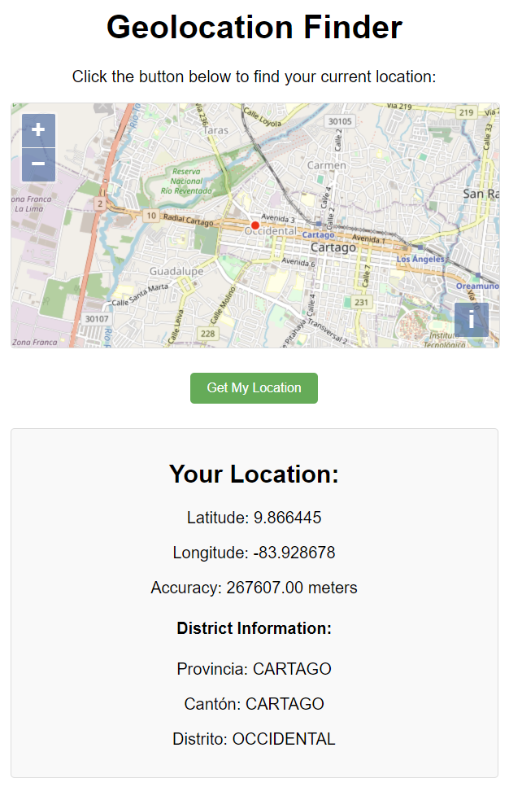

# encuentra_tu_distrito
base de datos espacial para econtrar un distrito en costa rica a partir de latitud y longitud

```bash
curl -X 'GET' 'http://127.0.0.1:3000/rpc/encontrar_distrito?lat=-84.1165&lng=9.9983'  -H 'accept: application/json'
```
```json
{"nom_prov":"HEREDIA","nom_cant":"HEREDIA","nom_dist":"HEREDIA","cod_prov":4,"cod_cant":1,"cod_dist":1}
```


